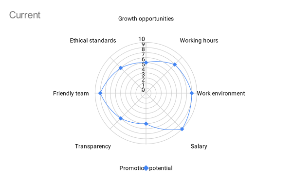
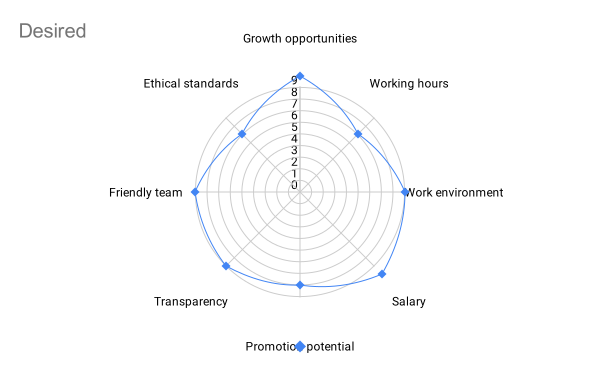

# 00. Job Criteria.

 - Currently, I am focusing on improving my skills and promotional opportunity is not the priority for me and to improve it, I will need to get work experience to understand more.
 - In the beginning of my career in IT sphere, promotional potential is the last thing I want. For me, it is very important to grasp most of the concepts before moving up in the ladder.
 - Transparency is always important for me, clear communication keeps the team strong.
 - In order to improve criterions, I will need to get experienced, learn from mistakes and get feedback.
 - Personal growth is always important for me, I always seek some ways I can grow, learn something new, I like to keep moving forward.
 - Work environment plays huge role in personal motivation to work and grow with the company.
 - Reasonable working hours help to maintain work and life balance, without one of them will start affecting the other.
 - Sufficient salary is one of the crucial aspects of any work, it is very important for me.

# 01. Career Goals.

### 1. Goals, reality, options and wills (GROW):
| Goals                                     | Reality                                                                                                                                                                                                                                                    | Options                                                                                                                                                                | Will                                                                                                                                                                                           |
| ----------------------------------------- | ---------------------------------------------------------------------------------------------------------------------------------------------------------------------------------------------------------------------------------------------------------- | ---------------------------------------------------------------------------------------------------------------------------------------------------------------------- | ---------------------------------------------------------------------------------------------------------------------------------------------------------------------------------------------- |
| To become lead developer in major company | I am a student at School 21, I know Kotlin, Jetpack Compose (Android), MVVM, Dependency Injection, I have couple of developed applications. Learning C, Kotlin, Java and Rust. I want to learn backend development, specifically Spring Boot framework. | - Complete the course. - Get a job in a big company and get real experience. - Get feedback from experienced developer. - Preparing for technical interviews. | - Complete School 21 course. - Learn algorithms. - Get my first job in IT. - Get experience from senior developers and managers. - Get a job offer in Canada. - Move to Canada. |

### 2. Where I am now and where I want to be:
| Today                                                                                                                                                                                                                                                           | 2-3 years | Career Goal (5 years)                                                                                                                                                                         |
| --------------------------------------------------------------------------------------------------------------------------------------------------------------------------------------------------------------------------------------------------------------- | --------- | --------------------------------------------------------------------------------------------------------------------------------------------------------------------------------------------- |
| In between jobs. Student at School 21. Somewhat experienced android developer. Skills I currently I have:  - Android (Kotlin, Jetpack Compose)  - Dependency Injection, MVVM, Clean Architecture, OOP  - C, functional programming, make, git | -         | - I want to be middle or senior developer in major company. - Experienced engineer. - To be respected member of a company. - To have work/life balance. - Earn sufficient salary. |

