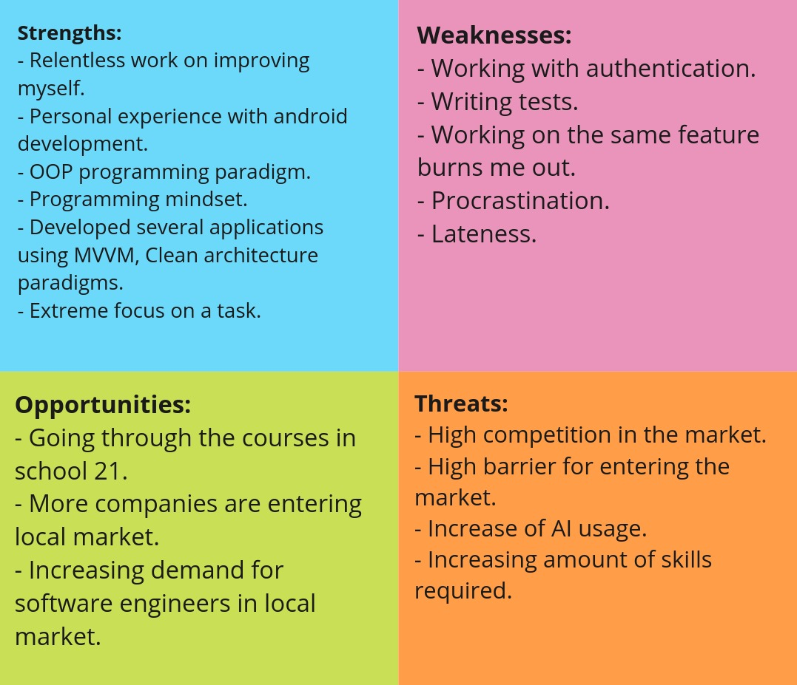

# CT01

## Exercise 00

### Company Selection

|  | Companies | Criterias |
| --- | --- | --- |
| 1 | Payme | Sufficient salary, promotional opportunities |
| 2 | Click | Sufficient salary, promotional opportunities, Trust |
| 3 | HamkorBank | Trust, personal growth, friendly team, sufficient salary, promotional opportunities |
| 4 | Yandex | Trust, personal growth, friendly team, sufficient salary, promotional opportunities |

### List of vacancies

|  | Job title | Salary Range | Requirements | Experience required | What is needed for experience | Responsibilities |
| --- | --- | --- | --- | --- | --- | --- |
| 1 | [Backend developer](https://it-market.uz/job/5CtgSwprmR9YiSJAJQjGgN/) | no info | Python, Java, Node.js, Databases, RESTful API, AWS, Azure, Google Cloud | At least 3 years | Get freelance experience, make pet-projects involving these technologies | Maintaining and development of server-side code. DB optimization, API maintenance, integration of third-party services, testing |
| 2 | [Backend developer Java](https://tashkent.hh.uz/vacancy/108205082?from=applicant_recommended&hhtmFrom=main) | $600 - $1700 | Java, Maven, Junit, Kafka, Git, Docker, SQL, Spring | No experience | Get freelance experience, make pet-projects involving these technologies | Maintaining of server-side code. Making simple SQL queries, integration with REST API |
| 3 | [Java Developer (Junior)](https://tashkent.hh.uz/vacancy/108219891?from=applicant_recommended&hhtmFrom=main) | from 5.000.000 soums | Java, build tools (Gradle), Oracle DB, RESTful API, WebSocket, OOP, Unit testing | 1-3 years | Get freelance experience, make pet-projects involving these technologies | Maintaining and development of backend software, working with Oracle DB, RESTful API and WebSocket Integration |
| 4 | [Middle/Senior Java Developer](https://tashkent.hh.uz/vacancy/108425340?from=employer&hhtmFrom=employer) | no info | Java 17+, Spring Boot, Kafka, ActiveMQ Artemis, REST API, JUnit, PostgreSQL, Spring Security | 3-6 years | Get freelance experience, make pet-projects involving these technologies | Service integration, external API integration, maintaining backend code, code review, writing unit tests |
| 5 | [Middle/Senior Golang developer](https://tashkent.hh.uz/vacancy/107787447?from=employer&hhtmFrom=employer) | no info | Go, Docker, REST API, PostgreSQL, git, Jira, Confluence, nix-systems | 3-6 years | Learn Go, learn microservices | Developing microservices, integration of microservices with others, unit testing |
| 6 | [Strong Middle/ Senior Full stack developer (mostly BE)](https://it-market.uz/job/5CtWxtWDzZMjAmEdxeaDj2/) | starting at $1000 | Typescript, Node.js, Vue.js, GraphQL, MySQL | 3-5 years | Work on pet-projects using the web-stacks mentioned | Maintenance of backend and fronted for construction company (inventory management) |
| 7 | [Backend developer (internship)](https://tashkent.hh.uz/vacancy/106440702?from=applicant_recommended&hhtmFrom=main) | no info | Java, Scala, Kotlin, Python, C++, C or Go (One of them) | No experience | nothing required | Microservices and integration (not much information is provided) |

## Exercise 01

### Vacancy Analysis

|  | Vacancies | Skills I have | Skills I don’t have |
| --- | --- | --- | --- |
| 1 | [Backend developer](https://it-market.uz/job/5CtgSwprmR9YiSJAJQjGgN/) | Java, REST API | Python, Node.js, Databases, Cloud services |
| 2 | [Backend developer Java](https://tashkent.hh.uz/vacancy/108205082?from=applicant_recommended&hhtmFrom=main) | Java, git, maven | Spring, Docker, SQL, JUnit, Kafka |
| 3 | [Java Developer (Junior)](https://tashkent.hh.uz/vacancy/108219891?from=applicant_recommended&hhtmFrom=main) | Java, Gradle, RESTful API, Unit testing, OOP | WebSockets, Oracle DB |
| 4 | [Middle/Senior Java Developer](https://tashkent.hh.uz/vacancy/108425340?from=employer&hhtmFrom=employer) | Java, REST API | Spring related tech, JUnit, Kafka, PostgreSQL |
| 5 | [Middle/Senior Golang developer](https://tashkent.hh.uz/vacancy/107787447?from=employer&hhtmFrom=employer) | REST API, git | Go, Docker, PostgreSQL, Jira, Confluence, nix-systems |
| 6 | [Strong Middle/ Senior Full stack developer (mostly BE)](https://it-market.uz/job/5CtWxtWDzZMjAmEdxeaDj2/) | None | Typescript, Node.js, Vue.js, GraphQL, MySQL |
| 7 | [Backend developer (internship)](https://tashkent.hh.uz/vacancy/106440702?from=applicant_recommended&hhtmFrom=main) | Java, Kotlin, C | Scala, Python, C++, Go |

### The ways I can obtain skills I don’t have:

- Work on pet-projects involving those technologies (eg. program that works with databases and API to create queries)
- Get a freelance job on related skills
- Familiarize myself with tools that are used in conjunction with development tools such as Jira.
- Do a daily challenge on leetcode on related skill (eg. algorithms).
- Working with a mentor is a great way to improve skills even with soft skills.

## Exercise 02

### Skills Analysis (SWOT)

