# DO1_Linux

# Part 1. Installation of the OS

## 1. Downloading the Ubuntu 20.04 LTS Server image (no GUI).

- We download server image from [**ubuntu.com**](https://ubuntu.com/download/server/thank-you?version=20.04.6&architecture=amd64&lts=true)(actual link to the server image) and save it in a drive with sufficient space, in this case we save it to location: `~/goinfre/ubuntu-20.04.6-live-server-amd64.iso`

## 2. Create a new virtual machine using VirtualBox.

- First step is to click on **New** button on the main menu
- Then, we give a name to VM, where is the virtual drive is going to be, type of system, version, memory size and whether to create a new drive or use existing one.
    - Name: **ubuntu_server**
    - Machine Folder: `/home/rigneysa/goinfre/`
    - Type: **Linux**
    - Version: **Ubuntu (64-bit)**
    - Memory Size: **1024 MB**
    - Virtual Drive Size: **10 GB**
- We finish the initial setup, now we need to attach our `.iso` image to the VM as CD/DVD drive. For this, we go to **Settings→Storage** and under **Controller: IDE** we click on empty slot, then on the right panel, we see an icon of drive, we click on it and select **Choose a disk file…**, after that, we navigate to `~/goinfre/` and select the downloaded server image. Finally, we can click **Ok** and start our VM.

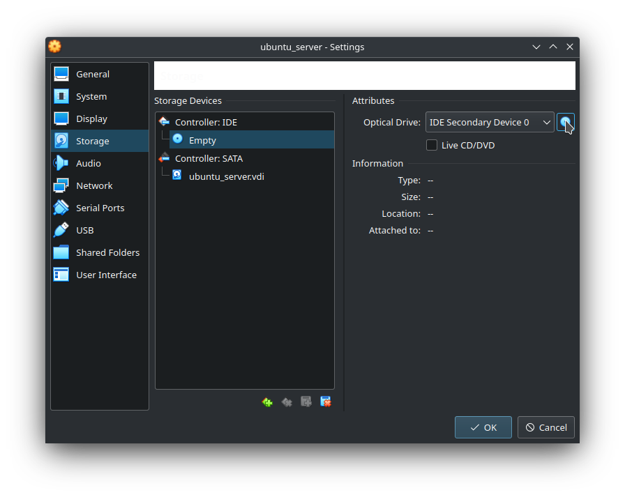

Screenshot 1. Selection of server image.

## 3. Installation process.

- Right after we click **Start**, we are greeted with **Language Selection** screen, in this case we choose **English**
- Then, we are prompted to update to newer version of installer, but in this case, we are fine the current version so we select **Continue without updating**
- Next screen, we are prompted to select **Keyboard Layout**, we will leave the default options - **English**
- The next step is **Network Configuration**, we are asked to configure existing network adapters. Here, the installer automatically configured virtual ethernet connection using **DHCP**, there is nothing for us to do, we click **Done**
- Next, we are asked to choose updating mirror for packages, the installer in this case has chosen the closest mirror available - `https://uz.archive.ubuntu.com/ubuntu`. For the best latency, we leave it as it is and click **Done**
- Following mirror configuration, we need to tell how we want to partition the drive. For this, we use the entire disk as it is isolated virtual machine and click **Done.** We are warned that changes are irreversible, we click **Continue**. The drive partition is pretty simple:
    
    ```bash
    Mount point  |   Size   |  Type
         /       |  8.25GB  |  EXT4
       /boot     |  1.75GB  |  EXT4
    ```
    
- The next screen, we need to create a user.
    - Name: **rigneysa**
    - Hostname: **ubuntu**
    - Username: **rigneysa**
    - Password: ***~~definitely a strong password~~***
- After setting up the user, we are asked if we want to install **OpenSSH server**, we are going to install it after we finish installation of the system so we continue *without installing*.
- The next screen we are asked if we want to install popular packages but we don’t need any for now, so we skip.
- After that, we will see installation process, just after installing, we are prompted if we want to update the packages but we will do it later, so we click on **Cancel update and Reboot**, which will reboot our freshly installed **Ubuntu server**.

## 4. Printing Ubuntu version.

To get the current version of Ubuntu, we simply run the command below:

```bash
cat /etc/issue
```

The output should be something like this:

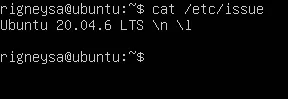

Screenshot 2. Ubuntu version.

---

# Part 2. Creating a user

## 1. Creating a user in `adm` group

```bash
sudo adduser -m -G adm user2
```


Screenshot 3. Command adding a new user with adding to a group `adm` . Output of `/etc/passwd` for **user2**

---

# Part 3. Setting up the OS network

## 1. Changing hostname of the machine.

- To change the hostname, we will use `hostnamectl` utility. The command is pretty simple:

```bash
sudo hostnamectl set-hostname user-1
```

- Then, we need to change hostname in `/etc/hosts` file. We will use vim for it

```bash
sudo vim /etc/hosts
```

- We will change the line where it says `127.0.1.1`, in this case we change `ubuntu` to `user-1`. The end result should look something like this:

```bash
127.0.0.1 localhost
127.0.1.1 user-1
...
```

- The result of our actions should look like this:

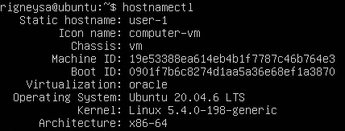

Screenshot 4. Hostname check

## 2. Setting the time zone.

- To set the correct time zone, we need to first search for the time zone we want, in this case we search for Samarkand:

```bash
timedatectl list-timezones | grep Samarkand
```

- In the output, we get the full timezone name: `Asia/Samarkand` . We set the timezone by the command:

```bash
sudo timedatectl set-timezone Asia/Samarkand
```

- Now, if we check the time with `timedatectl`, we should get the correct timezone.

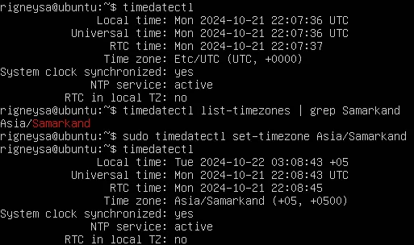

Screenshot 5. Commands to update the timezone

## 3. Network interfaces.

- To output the network interfaces, we use `ip` utility:

```bash
ip link show
```

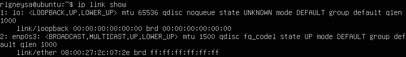

Screenshot 6. List of network interfaces

- `lo` interface is used for internal services, [`localhost`](http://localhost) and `127.0.0.1` IP adresses are used for this purpose, it is used for testing so you don’t need external interfaces.

## 4. Getting IP address

- There are many ways to get IP address. First method is to use `ip` utility:

```bash
ip addr show
```

- Second way is to use `hostname` utility:

```bash
hostname -I
```

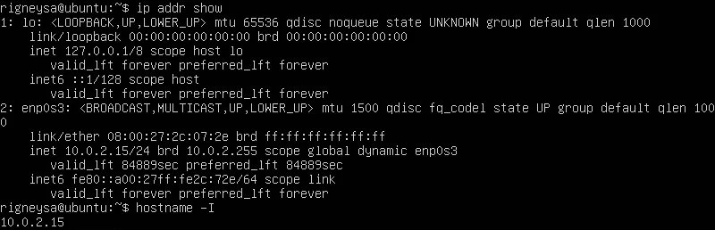

Screenshot 7. IP address of current machine

- **DHCP** stands for **Dynamic Host Configuration Protocol.**

## 5. External and internal IP addresses

- To get external IP address, we can use `curl` utility:

```bash
curl ifconfig.me
output: 217.30.173.218
```

- We can use `ip` utility to get default gateway internal IP address:

```bash
**rigneysa@user-1:~$** ip route show default
default via 10.0.2.2 dev enp0s3 proto dhcp src 10.0.2.15 metric 100
```

## 6. Setting static IP address

- Ubuntu uses `netplan` to configure networking. First, before we make changes, we need to backup the current configuration:

```bash
sudo cp /etc/netplan/00-installer-config.yaml /etc/netplan/00-installer-config.yaml.copy
```

- After that, we open `/etc/netplan/00-installer-config.yaml` using `vim` . We will set the IP to `10.0.2.100`, for that we will need the gateway address that we got from the previous section, we also set `dhcp4` to `false`. The end result should be something like this:

```nix
network:
  ethernets:
    enp0s3:
      dhcp4: false
      addresses:
        - 10.0.2.100/24
      routes:
        - to: 0.0.0.0/0
          via: 10.0.2.2
  version: 2
```

- Then, we need to change DNS server, they are located in a file `/etc/resolv.conf` . We will open the file using `vim`:

```nix
...
nameserver 1.1.1.1
nameserver 8.8.8.8
...
```

- After we save the file, we apply the changes using `netplan` command:

```bash
sudo netplan apply
```

- Now, if we check the IP address, it should change to `10.0.2.100`

## 7. Rebooting the VM

- After reboot we check the IP addresses:

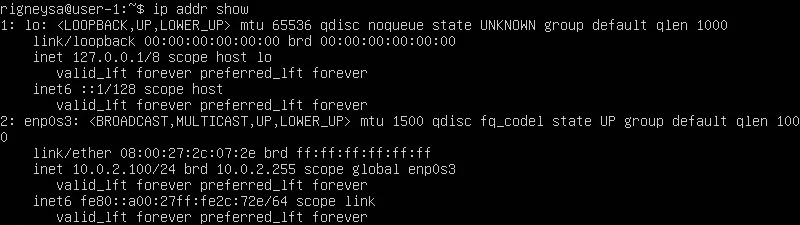

Screenshot 8. Network interfaces after change

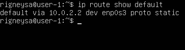

Screenshot 9. Gateway after change

- Now, let’s check connectivity, we will ping `1.1.1.1` and `ya.ru`:


Screenshot 10. Pinging `1.1.1.1` 5 times

 5 times](img/f9904a9d-3e0d-4cbb-ba9c-68dc68707efb.png)

Screenshot 11. Pinging [`ya.ru`](http://ya.ru) 5 times

---

# Part 4. OS Update

## 1. Updating the system packages

- We check package updates with `apt` command:

```bash
sudo apt update
```

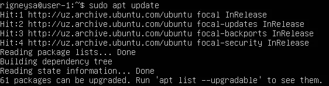

Screenshot 12. Checking for package updates

- We see that we have 61 packages to update. In order to update those packages we run:

```bash
sudo apt upgrade
```

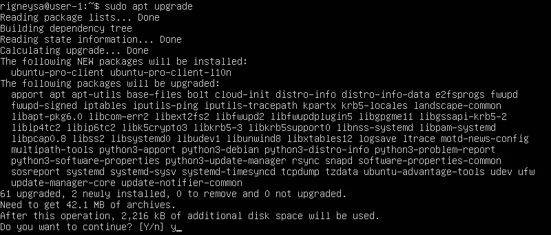

Screenshot 13. Prompt to upgrade packages

- We are prompted if we want to update, here you can see that there are **61** packages are going to be upgraded and **2** new packages will be installed, totaling **42.1 MB** for download and after update, it will take **2,216 kB** of storage. We type `y` but it is optional, since it is the default option, we click enter and the package manager will start upgrading the packages.
- Now, after that, if we check again with `sudo apt update` , it will say that everything is up to date.:

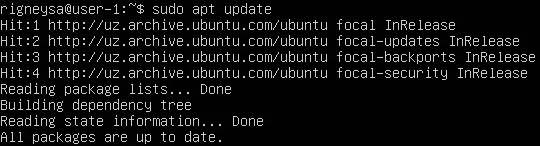

Screenshot 14. Final check for updates

---

# Part 5. Using the sudo command

## 1. Adding the second user to the sudoer group

- Adding a user to sudoers group is pretty easy, for that we use `usermod` utility:

```bash
sudo usermod -aG sudo user1
```

## 2. Changing the hostname using the user we created

- For that, type `exit` to logout, then we switch to `user1`. Then we change hostname using the command:

```bash
sudo hostnamectl set-hostname ubuntu-server
```

- Then, we also change `/etc/hosts` file again to reflect the changes:

```bash
127.0.0.1 localhost
127.0.1.1 ubuntu-server
...
```

- After that, if we type `hostname` , we should get updated name:

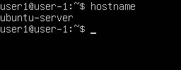

Screenshot 15. Updated hostname.

## 3. Explanation of sudo

- `sudo`  was created so users don’t have to login as `root` user. Root user gives full access to the machine which is dangerous, `sudo` was created for security reasons, so users could still perform critical operations without logged in as `root` user, sudo stands for **SuperUser DO**, it will perform operations as root when the sudo is used.

---

# Part 6. Installing and configuring the time service

## 1. Setting up automatic time synchronisation service

- First we check if the service is running now with command:

```bash
systemctl status systemd-timesyncd
```

- if it is not running we will start using:

```bash
sudo systemctl start --now systemd-timesyncd
```

- After that, we need to setup few things to enable NTPSynchronization. We need to edit the file `/etc/systemd/timesyncd.conf`:

```bash
[Time]
NTP=0.pool.ntp.org 1.pool.ntp.org 2.pool.ntp.org 3.pool.ntp.org
FallbackNTP=ntp.ubuntu.com
....
```

- Once we save the config file, we restart the service:

```bash
sudo systemctl restart systemd-timesyncd
```

- Finally, once we check `timedatectl show`, we should get correct timezone and synchronization:

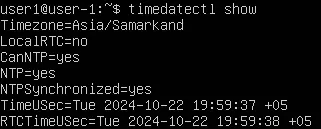

Screenshot 16. Synchronization and timezone status

---

# Part 7. Installing and using text editors

## 1. Installing text editors

- Installing text editors are pretty simple. We are going to use `apt` package manager for this:

```bash
sudo apt update
sudo apt install vim nano mcedit
```

## 2. Editing text using each editor

- Editing with `vim`:

```bash
vim test_vim.txt
```


Screenshot 17. VIM editor

- Quitting `vim` is easy, here are the steps:
    - First we click `ESC` key, if we are in `INSERT` mode.
    - Then, we type `:wq` and hit enter to exit.
- Editing with `nano`:
    
    ```bash
    nano test_nano.txt
    ```
    

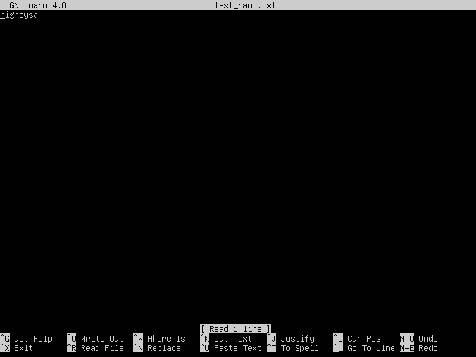

Screenshot 18. nano editor

- In order to quit `nano`, we follow the steps below:
    - Press `CTRL`+ `x`
    - We are prompted if we want to save the buffer, we click `y`
    - if you haven’t set the name for the file yet, you can set it here, in our case, we simply press `enter`
- Editing with `mcedit`:

```bash
mcedit test_mcedit.txt
```

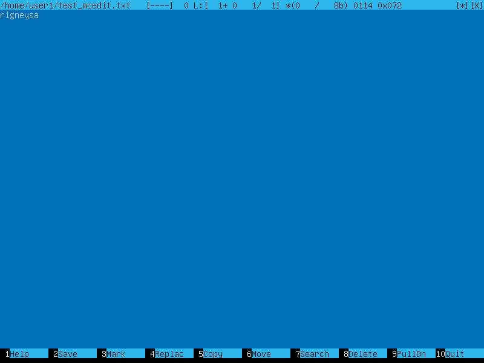

Screenshot 19. MCEDIT editor

- In order to quit `mcedit`, we follow these steps:
    - Press `F10`
    - We are prompted if we want to save the file, we click on `Yes`

## 3. Editing text without saving

- Editing with `vim`:

```bash
vim test_vim.txt
```


Screenshot 20. test_vim.txt before quitting

- In order to quit `vim` without saving, we follow these steps:
    - Press `ESC` if we are in `INSERT` mode
    - Type `:q!` to quit with discarding the changes
- Editing with `nano`:

```bash
nano test_nano.txt
```


Screenshot 21. test_nano.txt before quitting

- To discard the edits in `nano`, we follow these steps:
    - Press `CTRL` + `X`
    - Type `n` to discard
- Editing with `mcedit`:

```bash
mcedit test_mcedit.txt
```

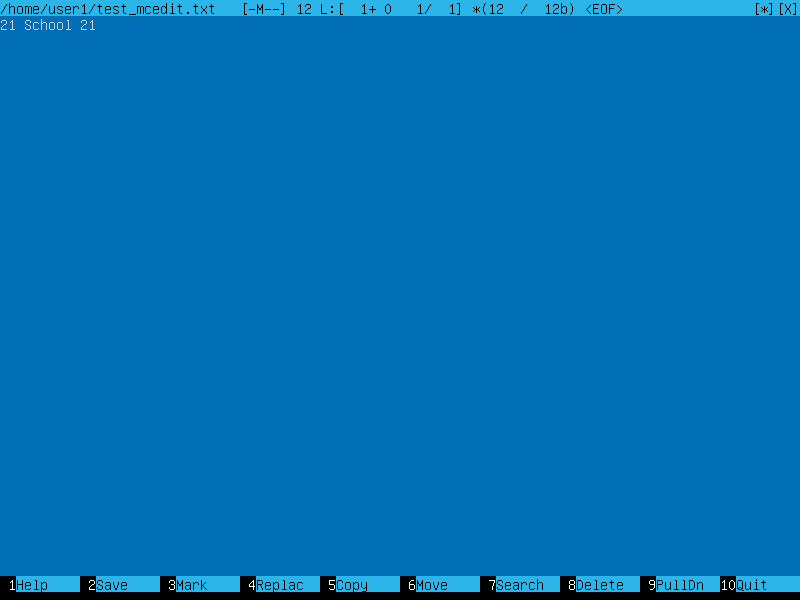

Screenshot 22. test_mcedit.txt before quitting

- In order to quit `mcedit` without saving, we follow these steps:
    - Click `F10`
    - Click `No`

## 4. Search and Replace

- Searching in `vim` is done by typing `/<search>`. Example:

```bash
/21
```


Screenshot 23. VIM search

- Search and replace. To replace we use `:s/<old_text>/new_text/g`:

```bash
:s/School 21/peer supremacy/g
```


Screenshot 24. VIM search and replace

- Search in `nano` is simple, we click `CTRL` + `W` and then type the search word:

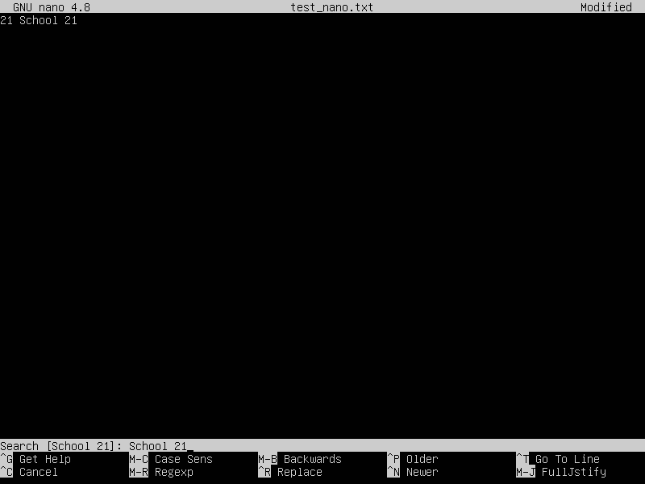

Screenshot 25. nano search

- To replace, we click `CTRL` + `R` in the same screen

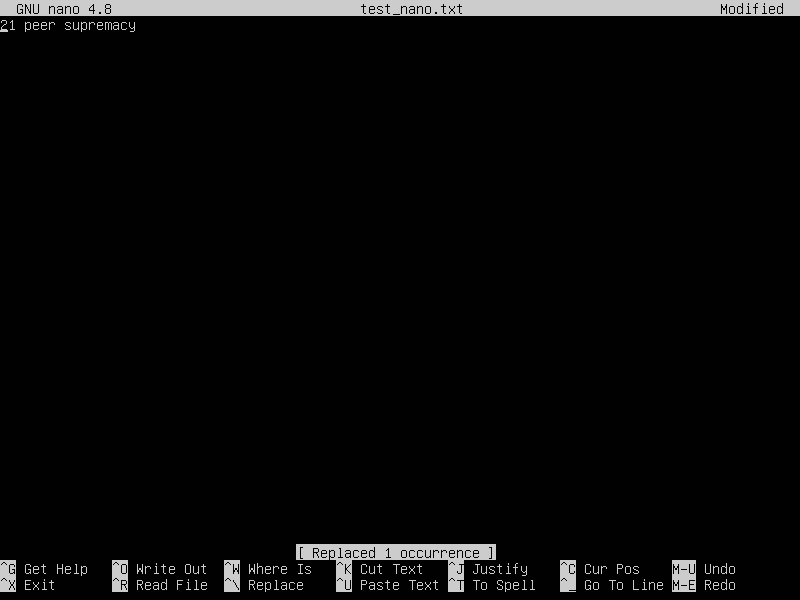

Screenshot 26. nano search and replace

- Searching in `mcedit` is one of the intuitive ones, you click `F7` to open search window, there are many options, it is very user-friendly:

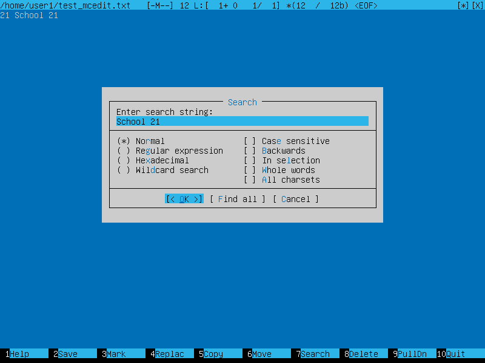

Screenshot 27. MCEDIT search

- Replacement is also very user-friendly as search function, for this, you need to click `F4` and you will see a window with search text and then replacement, you simply type what you want to replace, then click `OK`:

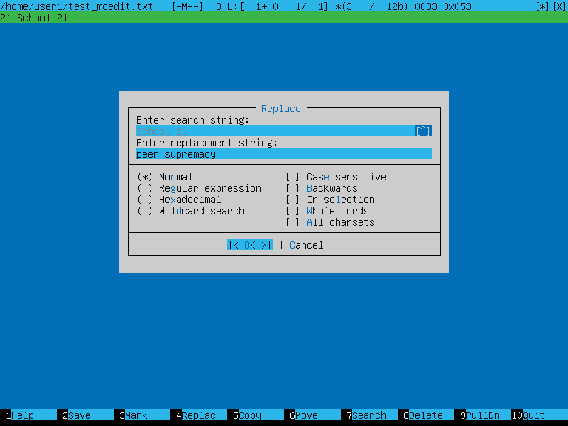

Screenshot 28. MCEDIT search and replace window

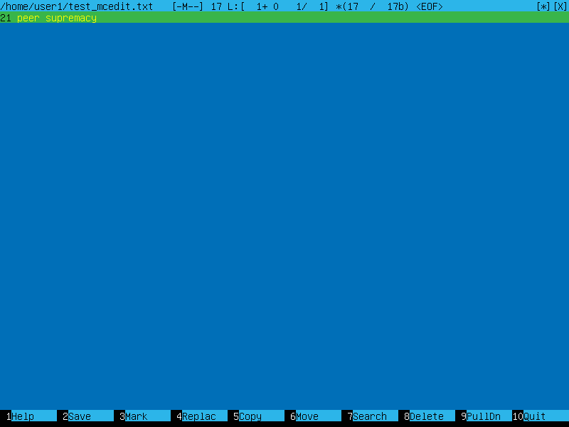

Screenshot 29. MCEDIT search and replace

---

# Part 8. Installing and basic setup of the SSHD service

## 1. Installation of SSHd service

- First we need to install `openssh-server` package:

```bash
sudo apt update
sudo apt install openssh-server
```

- After installing it, we start the service:

```bash
sudo systemctl start --now ssh
```

## 2. Autostarting the service on boot

- This step is very simple and done with one command:

```bash
sudo systemctl enable ssh
```

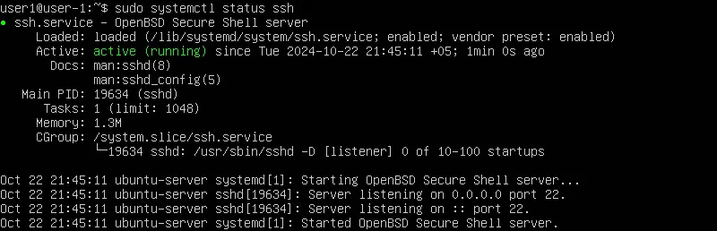

Screenshot 30. Status of SSH service

## 3. Switch the port of SSH server

- To change the default listening port, we need to edit `/etc/ssh/sshd_config` with root access, we change `Port` and `ListenAddress` to `2022` and `0.0.0.0` respectively:


Screenshot 31. Contents of `/etc/ssh/sshd_config`

- Then, we restart the service to apply the changes:

```bash
sudo systemctl restart ssh
```

or we can reboot:

```bash
reboot
```

- In order to check active ports we need `netstat` utility which is part of `net-tools` package:

```bash
sudo apt update
sudo apt install net-tools
```

- then we run the command:

```bash
netstat -tan
```

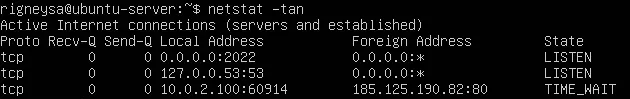

Screenshot 32. Active listening ports

- `0.0.0.0` essentially means that it is listening to **any** ip address both internal and external
- We can also check if the service is running using `ps` tool:

```bash
ps aux | grep sshd
```


Screenshot 33. Process status in `ps aux`

- Keys of `ps aux` utility:
    - **root** - user
    - **19634** - PID or Process ID
    - **0.0** - CPU usage in percentage
    - **0.7** - Memory usage in percentage
    - **12188** - Virtual memory usage in kB
    - **6980** - Physical memory usage in kB
    - **?** - Means that it is not attached to any terminal
    - **Ss** - Indicates the status of the process, in this case it is `Sleeping`
    - **21:44** - indicates starting time
    - **0:00** - CPU time or active time
    - `sshd: /usr/sbin/sshd -D [listener] 0 of 10-100 startups` - the command that is being executed

---

# Part 9. Installing and using the top, htop utilities

## 1. Installing and running top and htop

- `top` usually comes preinstalled on most systems so no need to install it, `htop` can be installed with command:

```bash
sudo apt update
sudo apt install htop
```

- From `top` we can get the following output:
    - Uptime: **17 min**
    - Number of authorized users: **1**
    - Average system load: **0.00 0.00 0.00** (idle)
    - Total number of processes: **94**
    - CPU load: **0.00 us**
    - Memory load:
        - Total: **965.1 MB**
        - Free: **458.2 MB**
        - Used: **137.8 MB**
        - Buffer/Cache: **369.1 MB**
    - Highest memory used:
        - PID: **645**
        - User: **root**
        - Virtual memory usage: **1173004 B**
        - Physical memory usage: **28560 B**
        - Shared memory usage: **18724 B**
        - Memory usage in %: **2.9%**
        - Uptime: **0:00.19**
        - Command: **snapd**
    - Highest CPU usage:
        - PID: **1433**
        - User: **rigneysa**
        - Virtual memory usage: **9136 B**
        - Physical memory usage: **3824 B**
        - Shared memory usage: **3300 B**
        - CPU usage: **0.3%**
- To sort by keys in htop, we use `SHIFT` key with corresponding letter:
    - `SHIFT` + `N` to sort by **PID**
    - `SHIFT` + `P` to sort by **CPU%**
    - `SHIFT` + `M` to sort by **MEM%**
    - `SHIFT` + `T` to sort by **TIME**

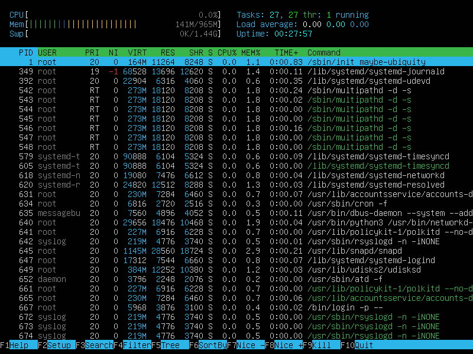

Screenshot 34. Sorting by PID

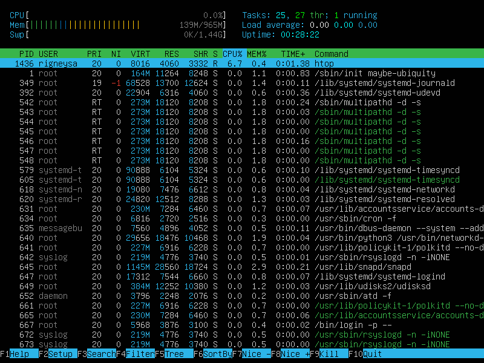

Screenshot 35. Sorting by CPU%

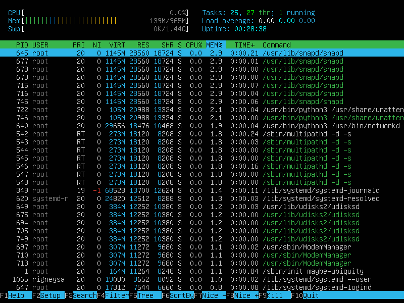

Screenshot 36. Sorting by MEM%

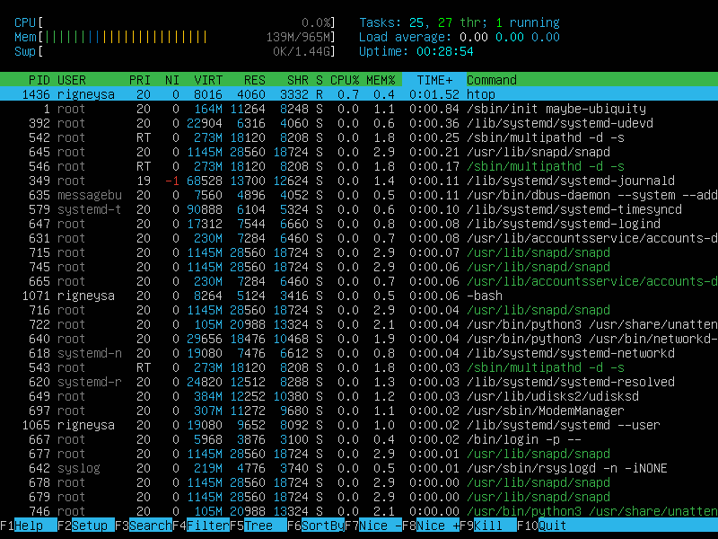

Screenshot 37. Sorting by TIME

- To filter for `sshd` process, we simply click `F4` and type `sshd`


Screenshot 38. Filtering for `sshd`

- To search, we click `F3` key and then type the search:

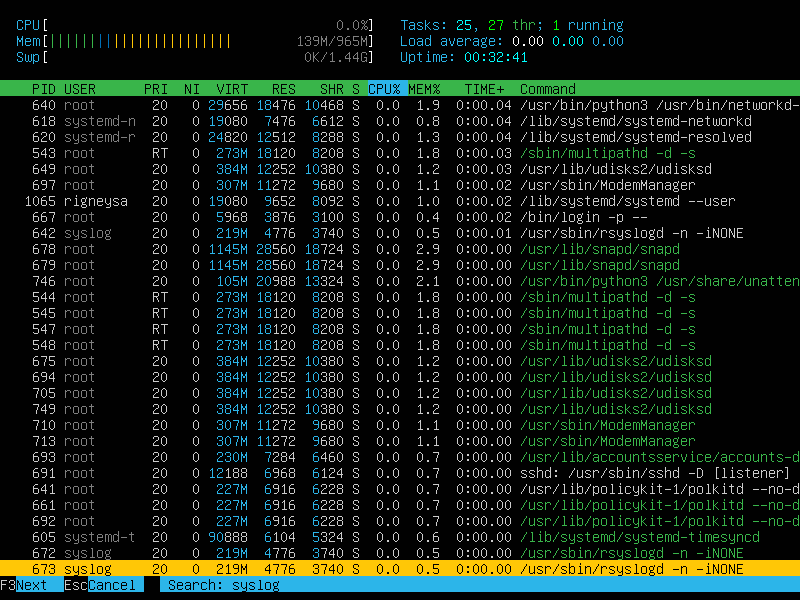

Screenshot 39. Searching for syslog in processes

- To get hostname, we simply type `hostname`:

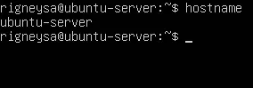

Screenshot 40. Hostname

- To get current time, we type `date`:

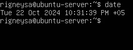

Screenshot 41. Current time

- To get uptime, we type `uptime`:

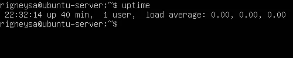

Screenshot 42. Machine uptime

---

# Part 10. Using the fdisk utility

## 1. Using fdisk -l command

To run `fdisk` utility, we need root access

```bash
sudo fdisk -l
```

- Output should look like this in our case:
    - Disk: `/dev/sda`
    - Size: `10 GB`
    - Number of sectors: `20971520` * `512 bytes`
    - Swap size: `none` because we haven’t created a swap

---

# Part 11. Using the df utility

## 1. Running df command

To get space used, we run:

```bash
df
```

- Output should be something like this for `/`:
    - Partition size: **8408452 kB**
    - Space used: **4322660 kB**
    - Space free: **3637076 kB**
    - Percentage used: **55%**

## 2. Running df -Th command

```bash
df -Th
```

- Output should be something like this for `/`:
    - Partition size: `8.1 GB`
    - Space used: `4.2 GB`
    - Space free: `3.5 GB`
    - Percentage used: `55%`
    - Type: `ext4`

---

# Part 12. Using the du utility

## 1. Running the du command

```bash
du
```

It will output the size of files in current directory

## 2. Getting sizes of /home, /var, /var/log

- Getting size of `/home`  in bytes:

```bash
sudo du -sb /home
```

- Getting size of `/home` in human readable format:

```bash
sudo du -sh /home
```

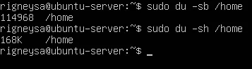

Screenshot 43. Size of home directory

- getting size of `/var` in bytes:

```bash
sudo du -sb /var
```

- getting size of `/var` in human readable format:

```bash
sudo du -sh /var
```

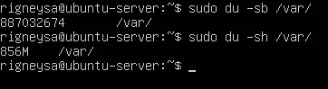

Screenshot 44. Size of /var directory

- getting size of `/var/log` in bytes:

```bash
sudo du -sb /var/log
```

- getting size of `/var/log` in human readable format:

```bash
sudo du -sh /var/log
```

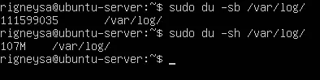

Screenshot 45. Size of /var/log directory

- getting size of each element in `/var/log/` directory:

```bash
sudo du -sb /var/log/*
```

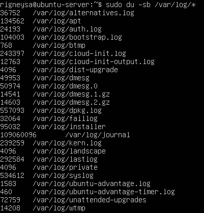

Screenshot 46. Size of each element in /var/log/ directory in bytes

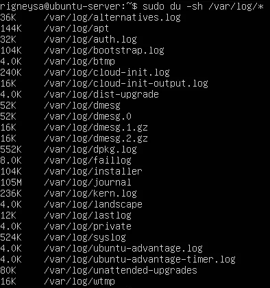

Screenshot 47. Size of each element in /var/log/ directory in human readable format

---

# Part 13. Installing and using the ncdu utility

## 1. Installing the ncdu utility

- To install `ncdu`, we will use `apt` package manager:

```bash
sudo apt update
sudo apt install ncdu
```

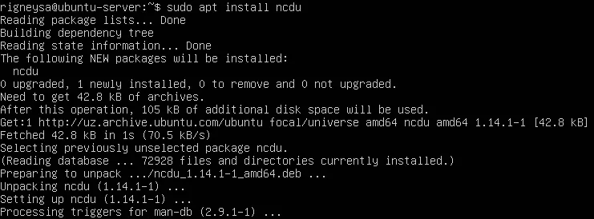

Screenshot 48. Installation of ncdu utility

## 2. Output sizes of /home, /var, /var/log

- Size of `/home`: **168.0 KiB**

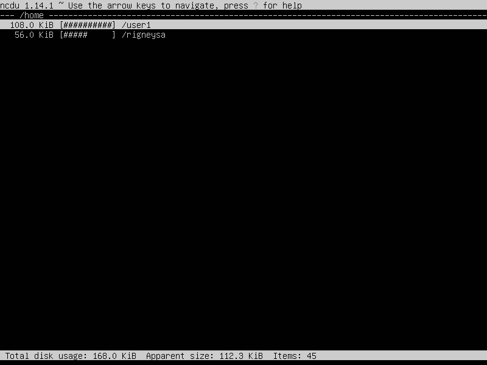

Screenshot 49. home directory size

- Size of `/var`: **855.2 MiB**

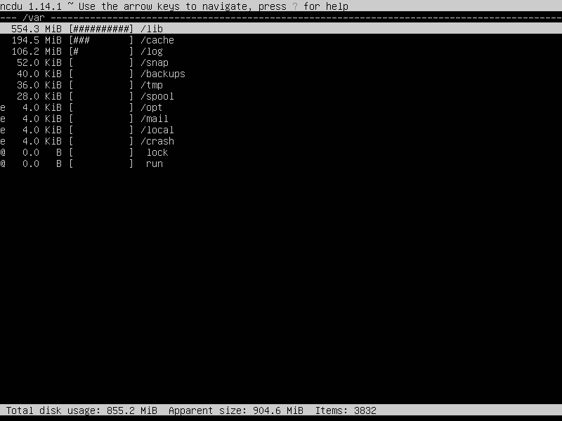

Screenshot 50. Size of /var directory

- Size of `/var/log`: **106.2 MiB**

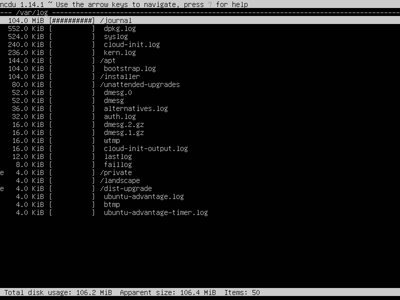

Screenshot 51. Size of /var/log

---

# Part 14. Working with system logs

## 1. Opening /var/log/dmesg:

- To view it, we simply type:

```bash
vim /var/log/dmesg
```

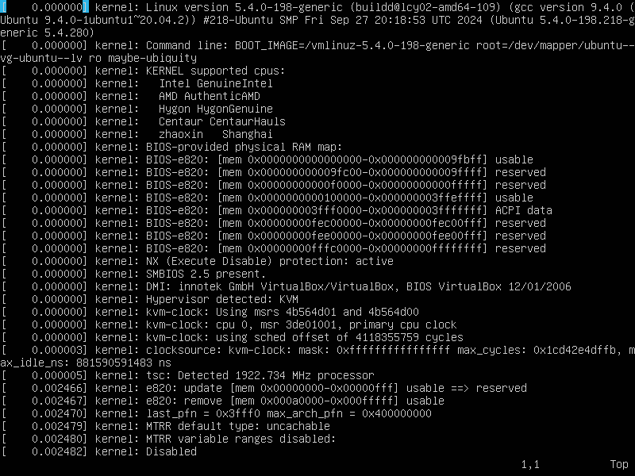

Screenshot 52. /var/log/dmesg file

## 2. Opening /var/log/syslog:

- To view it, we can use any editor:

```bash
vim /var/log/syslog
```

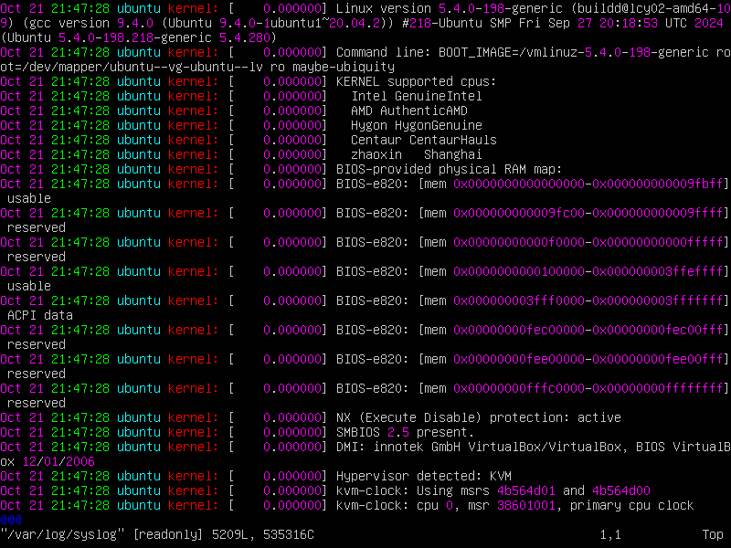

Screenshot 53. /var/log/syslog file

## 3. Opening /var/log/auth.log

- The way it is done is the same:

```bash
vim /var/log/auth.log
```

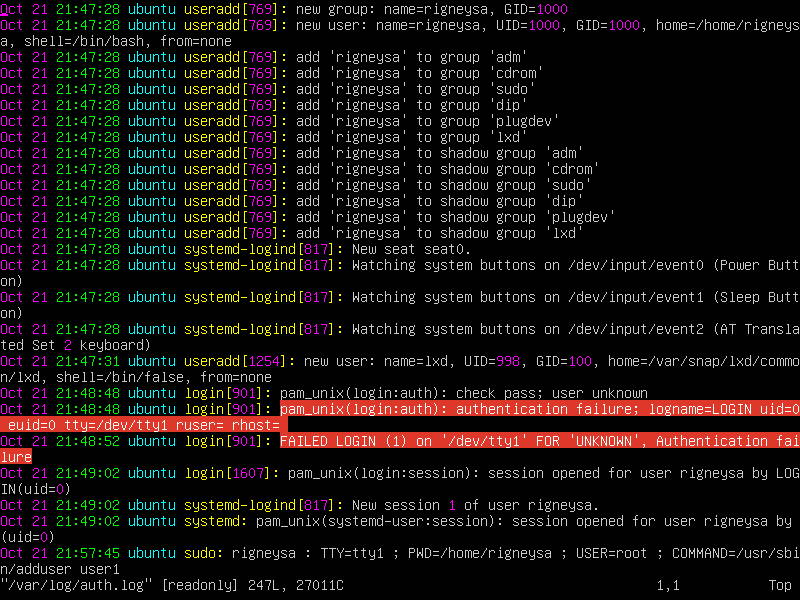

Screenshot 54. /var/log/auth.log file

- Last successful login time: **21:54:51 Oct 22**

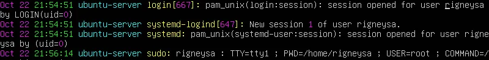

Screenshot 55. Last successful login

- To restart ssh service, we simply run:

```bash
sudo systemctl restart ssh
```

- Then, we can check the status:

```bash
sudo journalctl -u ssh.service
```

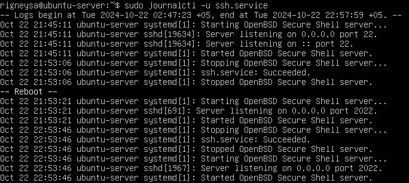

Screenshot 56. Logs for restart

---

# Part 15. Using the CRON job scheduler

## 1. Running a job every 2 minutes

- To add a new job, we need to edit crontab jobs. For that, we run:

```bash
crontab -e
```

- Then, we add the following line using our preferred editor, i will choose `vim` . We will add the following line:

```bash
*/2 * * * * uptime
```

- Then we can verify it by using the command `crontab -l`:

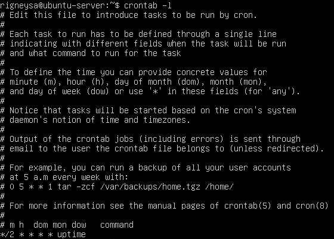

Screenshot 59. Crontab jobs

- After a while, we can check the logs `/var/log/syslog`:

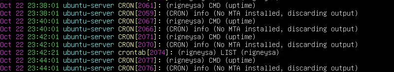

Screenshot 58. Logs of execution