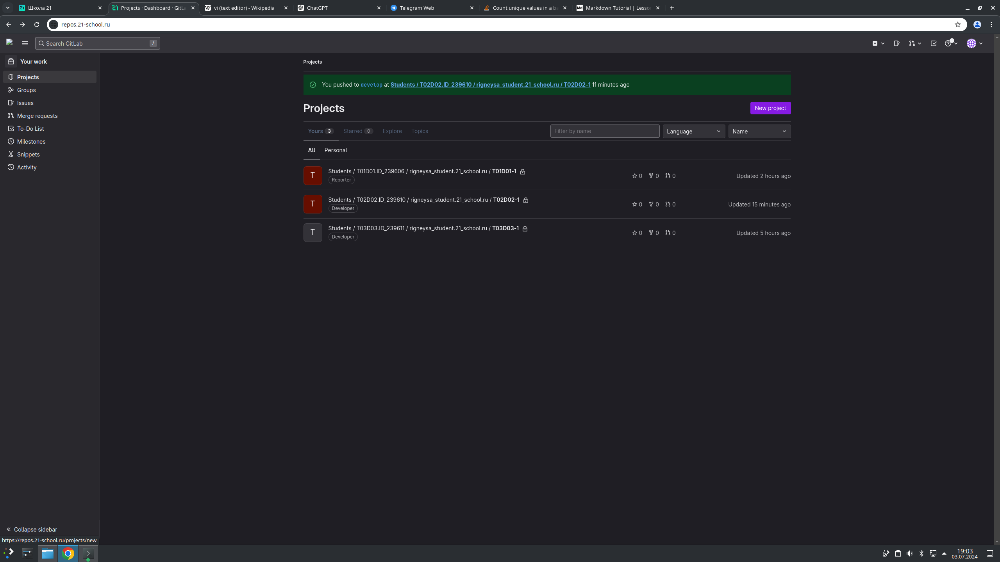
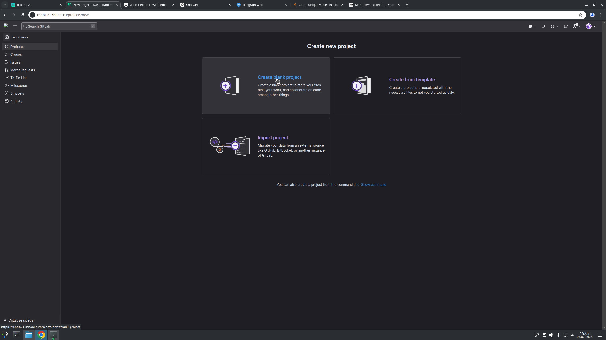
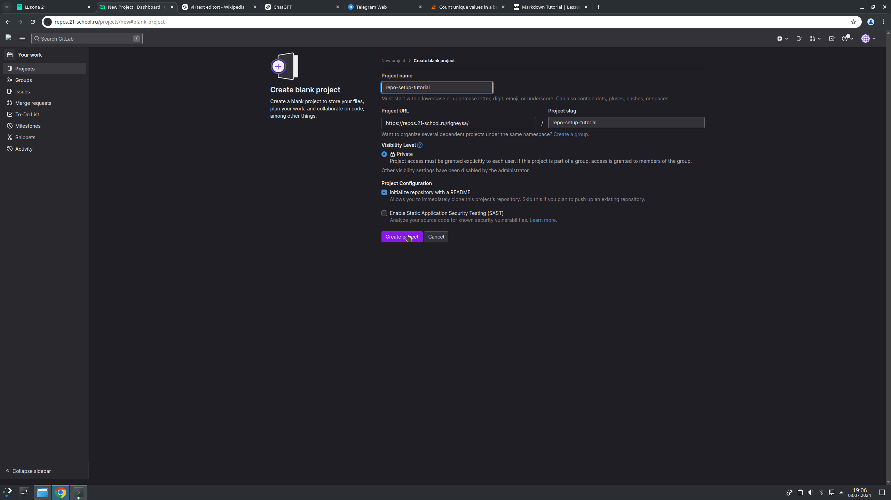
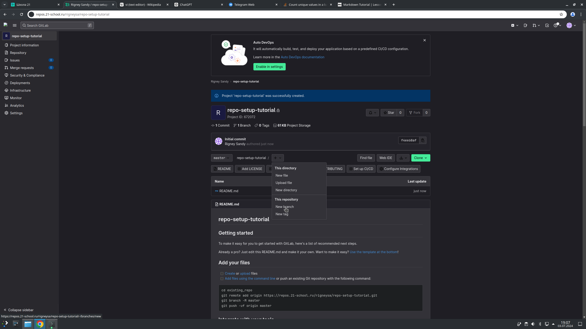
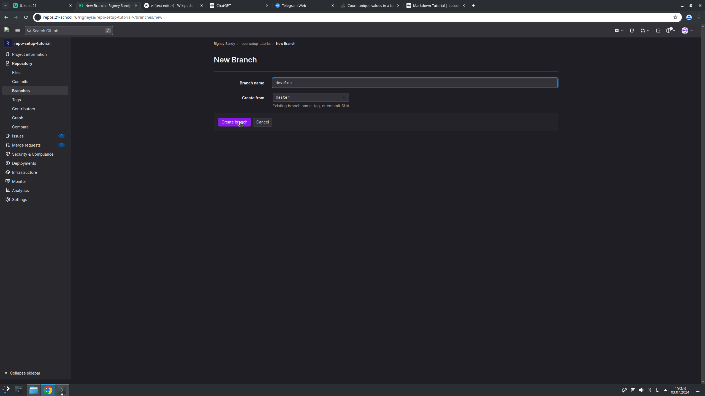
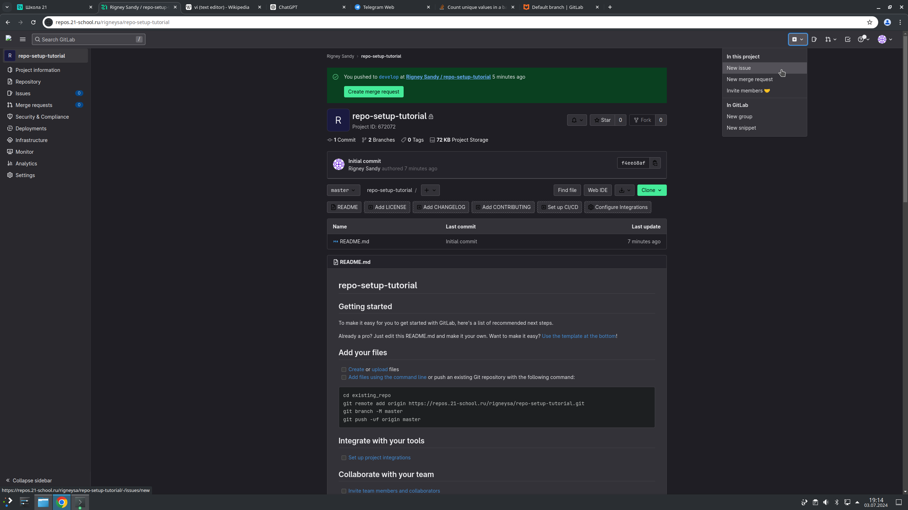
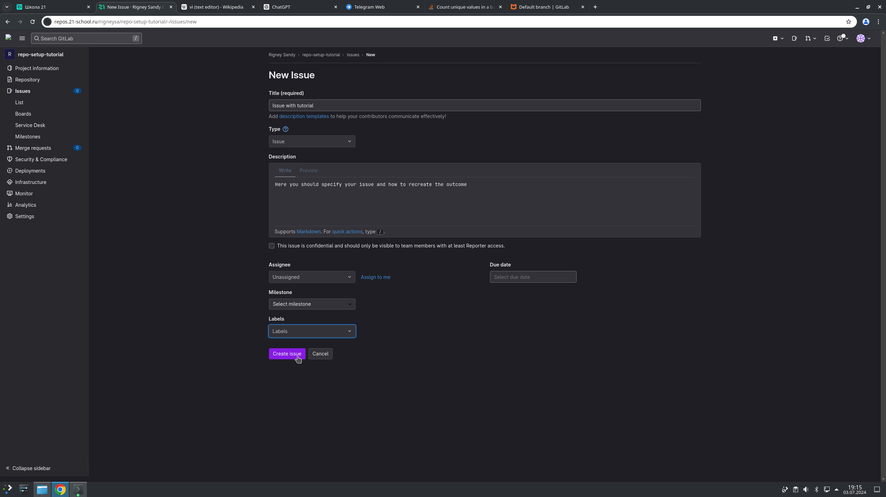
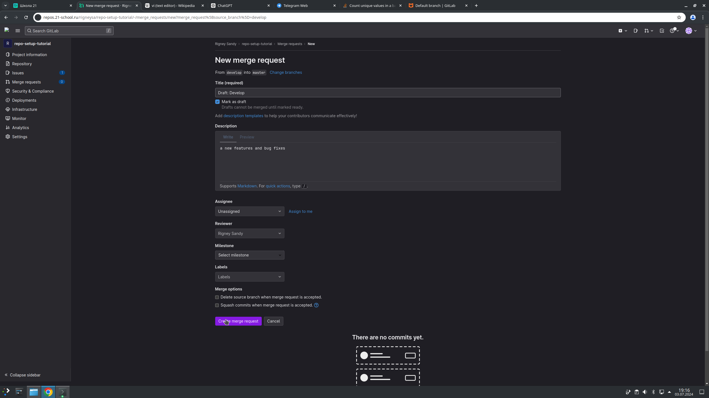

# GitLab repository setup tutorial

## 1. Creating a personal repository with the correct `.gitignore` and simple `README.MD`

To create our first repository, we should go to our GitLab page and create a new project as shown in _Screenshot 1_ and _Screenshot 2_

Now we give a project name and create `.gitignore` and `README.MD`. see _Screenshot 3_

and after that we are done!

## 2. Creating `develop` and `master` branches

`master` branch is created by default, we just need to create a `develop` branch, it can be done in the repository itself by clicking the button **New** and then **New branch**. After clicking you will be prompted to fillout the name and which branch to copy from. refer to _Screenshot 4_ and _Screenshot 5_.

after that we have created `develop` branch and we should push our code there first, before merging with master

## 3. Setting the `develop` branch as the default

To make `develop` branch as the default one, we should go to repository settings and change default branch from `master` to `develop`. It is that easy!

## 4. Creating an issue for creating the current manual

To create an issue, you should plus button in the right top corner bar(_refer to Screenshot 6_). After that you give a title suitable for your issue and then describe your issue as shown in _Screenshot 7_.

## 5. Creating a branch for the issue

To create a branch for the issue, you can go to Issues and click on the issue, there will be a button **Create Branch**, you click on that and give a name and base branch to create from

## 6. Creating a merge request on the `develop` branch

For this, make sure you are in `develop` branch otherwise switch to `develop`. Then you click on **Merge Requests** and create new one as shown in _Screenshot 8_ and _Screenshot 9_.

## 7. Commenting and accepting the request

Requests can be accepted in **Merge Requests** page on the left, you should review and merge branches

## 8. Creating a stable version in the `master` with a tag

Tags can be created on the same place as branches, you click on **add** and select **new tag**, you give a name to a tag, in this case it is - `stable`, then you select the branch for tag, we select `master` and we are done! :)
